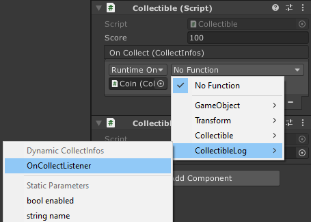

# Empty Platformer project - How to use events, and react to what happens in the game?

In order to let you add effects and feedbacks without needing to modify the gameplay implementation, this project uses a lot of `UnityEvent`s.

## Why using `UnityEvent`s?

Let's say you're creating a simple health system, where you lose lives when you're hit. This mechanic is very simple, but in order to show it clearly to your player, you'd probably show the value on the UI, add sound effects when you're hit, animations, particle effects, etc..

If you're a beginner to Unity or code, you can implement all these feedbacks in the script itself like:

```cs
using UnityEngine;
public class HealthExample : MonoBehaviour
{
    public AudioSource sfxOnHit = null;
    public ParticleSystem particlesOnHit = null;
    public Animator animator = null;

    public int lives = 3;
    
    public void LoseLife()
    {
        lives--;
        sfxOnHit.Play();
        particlesOnHit.Play();
        animator.SetTrigger("hit");
    }
}
```

This works fine. But what if you need to change the text of the UI when you're hit? What if the name of the `AnimatorController` trigger changes? What if you want to add a screen shake effect? Yeah, you'll need to update that code. And you don't want to do that for a simple reason: your script depends on several others, and this can make your code difficult to read, to reuse, and to maintain.

Updating code can be intimidating or difficult for one that doesn't know much about scripting. It's even more true when you need to update a code written by another person.

So, using `UnityEvent`s will solve two problems at once:

- Decouple your gameplay scripts from feedbacks, making it easily reusable and easy to setup
- Prevent for updating existing code that is not directly related to a mechanic

## Use `UnityEvent`s

In code, *events* are a list of actions triggered when something happens in your application. `UnityEvent`s follow this principle (since they actually *are* C# events), but they provide an editor UI that allow you to bind actions to them from the editor, without opening a code editor.

Let's update the previous example script to use `UnityEvent`:

```cs
using UnityEngine;
using UnityEngine.Events; // Import this namespace in order to use UnityEvents
public class HealthExample : MonoBehaviour
{
    public int lives = 3;
    public UnityEvent onLoseLife;

    public void LoseLife()
    {
        lives--;
        onLoseLife.Invoke(); // The Invoke() method will trigger the event, and call all its callbacks
    }
}
```

You can see that all dependencies (references to `Animator`, `AudioSource` and `ParticleSystem`) have been removed. But if you go back to Unity editor, you will see that this component has a brand new inspector UI.


You can see a new block *On Lose Life* with *Add* and *Remove* buttons. Use these buttons to add or remove callbacks (functions to call when the event is triggerd) to this event.

As an example, add an `Animator` component to the object that has the `HealthExample` component if it doesn't have one already. Now, click on the *Add* ( + ) button. In the object field (under the dropdown), place the `GameObject` itself (you can even drag and drop one of its component, like the `Animator` you've just created). In the right part, you can see a dropdown that contain *No Function* by default. If you click on it, you'll see a list of components. These components are all the ones placed on the referenced `GameObject`. In our case, you should at least see `Transform`, `Health Example` and `Animator`. Select the `SetTrigger(string)` function, in the `Animator` submenu. This means that when the `On Lose Life` event is triggered, the object will call the `SetTrigger()` method of the `Animator`. Since that method takes a string parameter, you can set it in the text field that should've appeared below the function dropdown. Type "hit" in it.


With this setup, the *hit* trigger of your `Animator Controller` will be enabled when the `On Lose Life` will be triggered. And that's all the `UnityEvent` power: you can then click on the *Add* button, and add more callbacks without editing the code! Try it by adding a `ParticleSystem` component and call the `Play()` method on it, the process is the same.

And here you go: the gameplay script is totally independent of your UI or any other feedback!

### Use `UnityEvent`s through code

You can still use the events through code. To do so, use the `AddListener()` or `RemoveListener()` methods on `UnityEvent` to add or remove a callback. By the way, when it comes to events, bound methods are called *listeners*.

For example, the following script can be placed on a Canvas, and will display the remaining lives:

```cs
using UnityEngine;
public class HealthExampleUI
{
    HealthExample health = null;
    UI.Text livesUIText = null;

    private void Awake()
    {
        health = FindObjectOfType<HealthExample>();
    }

    private void OnEnable()
    {
        health.onLoseLife.AddListener(UpdateRemainingLivesText);
    }

    private void OnDisable()
    {
        health.onLoseLife.RemoveListener(UpdateRemainingLivesText);
    }

    private void UpdateRemainingLivesText()
    {
        livesUIText.text = "Remaining lives: " + health.lives;
    }
}
```

You can see in this example that we used `OnEnable()` to add the listener, and `OnDisable()` to remove it. This will bind the callback only when the UI is enabled, and unbind it when the UI is disabled, so the UI is never updated if it's not active and enabled.

Also note that in order to update the content of the UI, we never use `Update()`: the UI is redrawn only when the event is triggered, instead of being redrawn each frame!

## Practical use case: bind action to `Collectible.OnCollect` event

The following guide will show you how to create a script that dynamically get and use the informations sent by the project's components.

As an example, you can find a component named [`Collectible`](./collectible.md) that represents an object that can be collected by the player. This component has an event named `On Collect` that is triggered when the object is collected by the player. And that event has a specific type, which is `CollectInfos`. This structure is a collection of data that can be used to trigger an appropriate feedback. So, the `On Collect` infos will send these data when it's triggered.


Here is the implementation of the `CollectInfos` structure:

```cs
[System.Serializable]
public struct CollectInfos
{
    public int score;
    public Vector3 position;
    public GameObject collector;
}
```

You can see that when the `On Collect` event is triggered, it sends several data: the amount of score that the collectible offers, the position of the collectible when it's collected, and the `GameObject` that represents the entity that collected it.

You can bind actions to this event just as explained above, but if you want to get and use the data sent in this event, there is an extra step: you'll have to use dynamic parameters.

This is a simple mechanic in Unity, that allow you to bind a method that takes a parameter of the same type of the event to listen.

```cs
using UnityEngine;
public class CollectibleLog : MonoBehaviour
{
    public Collectible collectible;

    public void OnCollectListener(CollectInfos infos)
    {
        Debug.Log("Collectible has been collected at " + infos.position + ", and offered " + infos.score + " points.");
    }
}
```

You can notice in that example component the method `OnCollectListener()` that takes a parameter `infos` of type `CollectInfos`. Back to Unity, if you try to bind the `OnCollectListener()` method to the `On Collect` event, you'll see a *Dynamic CollectInfos* section in the list:



This means that Unity will send the event data directly to the method when it's triggered, so you can use these data as expected. If you use this component in the demo scene, you should see the log line when the item is collected!

## Related links

- [Official `UnityEvent` manual](https://docs.unity3d.com/Manual/UnityEvents.html)
- [Official `UnityEvent` scripting API documentation](https://docs.unity3d.com/ScriptReference/Events.UnityEvent.html)

---

[<= Back to summary](./README.md)